# Yuki 3.0 — Big Picture

**Selected shape:** B (Clean Rebuild — Next.js + React + Convex)

---

## Frame

### Problem

- Two caretakers share responsibility for a dog's complex daily medication regimen (eye drops with timing constraints, oral meds, supplements)
- Coordination happens via texts and memory — leading to missed doses, double doses, and mental overhead
- Neither caretaker can quickly know "what's done, what's left, what's overdue" without asking the other
- No reliable history record for vet visits or medication compliance tracking
- The existing Yuki 2.0 app (Vue 3 / Pinia) solves many problems individually but has gaps in real-time coordination, offline resilience, and instant-comprehension UX

### Constraints

- **Zero cost** — entire stack on free tiers (Convex Starter, Cloudflare Workers free)
- **Pet-agnostic** — data model works for any pet type
- **iOS-first notifications** — Web Push API on home screen PWA (iOS 16.4+), Cloudflare Worker as push server
- **MVP scale** — 2-3 caretakers, 1 pet

### Outcome

- Either caretaker opens the app and instantly knows the day's medication status
- Confirming a medication is a single tap
- Both caretakers see each other's actions in real time — no double-dosing
- The app works even with poor connectivity
- A complete medication history is available for vet visits
- Push notifications on iOS when medications are due or overdue
- **Success = the caretakers stop texting each other about medications entirely**

---

## Shape

### Stack

| Layer | Choice |
|-------|--------|
| Framework | Next.js (App Router) + React + TypeScript |
| State | Convex React hooks + Zustand (local UI only) |
| Styling | Tailwind CSS 4 |
| UI Components | uselayouts (copy-paste, Shadcn-style) + Motion |
| Auth | Clerk (login UI, user management, JWT for Convex) |
| Backend | Convex (free Starter plan) + custom IndexedDB offline layer |
| Push Notifications | Cloudflare Worker + Web Push API (iOS-first) |
| Package Manager | pnpm (bun for scripts) |
| Code Quality | oxc |
| Shared Packages | tsup |
| PWA | Serwist |
| Testing | Vitest (via Vite) |
| Monorepo | pnpm workspaces |

### Fit Check (R x B)

| Req | Requirement | Status | B |
|-----|-------------|--------|---|
| R1 | Multiple caretakers need confidence medications were given — and by whom — without calling or texting each other | Must-have | ✅ |
| R2 | A caretaker picking up their phone should know in under 3 seconds: what's done, what's not, and what's overdue | Must-have | ✅ |
| R3 | The system must understand medication timing (morning/evening, minimum spacing between eye drops) and surface what matters right now | Must-have | ✅ |
| R4 | Completion logging must be faster than sending a text message (single-tap target) | Must-have | ✅ |
| R5 | Two caretakers active simultaneously must see each other's actions in real time; double-dosing is a safety concern | Must-have | ✅ |
| R6 | The app must remain fully functional offline and reconcile state when connectivity returns | Must-have | ✅ |
| R7 | Care plan configuration (admin) and daily task confirmation (caretaker) are separate authorities | Must-have | ✅ |
| R8 | Reviewable record of what happened, when, and who did it — across days and weeks | Must-have | ✅ |
| R9 | Caretakers can capture unstructured observations (symptoms, notes, unscheduled events) alongside the structured routine | Must-have | ✅ |
| R10 | PWA that feels instant, is installable to home screen, and behaves like a native app | Must-have | ✅ |

### Parts

| Part | Mechanism | Flag |
|------|-----------|:----:|
| **B1** | `@yuki/types` package — shared TypeScript types supplementing Convex-generated types, bundled with tsup | |
| **B2** | `convex/` directory — schema, query/mutation functions, auth config. Replaces `@yuki/firebase` package | |
| **B3** | Convex `useQuery` hooks as the primary reactive data source — all queries are live subscriptions by default. Zustand only for local UI state | |
| **B4** | Custom offline layer: IndexedDB cache of today's schedule + mutation queue when offline, flush via Convex mutations on reconnect | |
| **B5** | Presence system as a React hook (`usePresence`) — writes heartbeat via Convex mutation, reads via `useQuery` | |
| **B6** | Dashboard designed around "Right Now" hero — hero item computed server-side in Convex query, one-tap confirm, then timeline | |
| **B7** | One-tap confirm with `useMutation` optimistic update, undo toast, and ACID transaction preventing double-dosing | |
| **B8** | React component library built from requirements using uselayouts + Motion for interactions | |
| **B9** | TypeScript authorization checks in Convex server functions, written alongside each feature | |
| **B10** | PWA shell with Serwist, precaching, runtime caching strategies, skeleton screens | |
| **B11** | Ad-hoc observation capture integrated into the timeline | |
| **B12** | History view with filterable audit trail — server-side filtering in Convex queries | |
| **B13** | Admin view for care plan management — add/edit/deactivate medications, set schedules, manage conflict groups | |

### Breadboard

```mermaid
flowchart TB
    subgraph login["PLACE: Login"]
        U1["U1: password input"]
        U2["U2: login button"]
    end

    subgraph dashboard["PLACE: Dashboard"]
        subgraph hero["Hero Section"]
            U3["U3: right now hero card"]
            U4["U4: hero confirm button"]
            U5["U5: undo toast"]
        end
        subgraph timeline["Timeline Section"]
            U6["U6: timeline list"]
            U7["U7: timeline confirm"]
            U8["U8: timeline snooze"]
            U13["U13: observation inline"]
        end
        U9["U9: presence indicator"]
        U10["U10: progress ring"]
        U11["U11: add observation FAB"]
        U12["U12: observation sheet"]
    end

    subgraph history["PLACE: History"]
        U14["U14: date picker"]
        U15["U15: filter chips"]
        U16["U16: history list"]
        U17["U17: entry detail"]
    end

    subgraph admin["PLACE: Admin"]
        U18["U18: medication list"]
        U19["U19: add/edit med form"]
        U20["U20: schedule builder"]
    end

    subgraph settings["PLACE: Settings"]
        U21["U21: notification toggle"]
        U22["U22: account info"]
    end

    subgraph global["GLOBAL"]
        U23["U23: offline indicator"]
        U24["U24: bottom tab bar"]
        U25["U25: skeleton screens"]
    end

    subgraph stores["DATA LAYER"]
        N1["N1: auth service"]
        N2["N2: auth store"]
        N3["N3: instances store"]
        N4["N4: usePresence hook"]
        N5["N5: confirm action"]
        N6["N6: undo action"]
        N7["N7: snooze action"]
        N8["N8: observation action"]
        N9["N9: history store"]
        N10["N10: items store"]
        N11["N11: notification service"]
    end

    subgraph infra["INFRASTRUCTURE"]
        N12["N12: offline layer"]
        N13["N13: convex backend"]
    end

    U1 --> N1
    U2 --> N1
    N1 --> N2
    U3 -.-> N3
    U4 --> N5
    U5 --> N6
    U6 -.-> N3
    U7 --> N5
    U8 --> N7
    U9 -.-> N4
    U10 -.-> N3
    U11 --> U12
    U12 --> N8
    U13 -.-> N3
    U14 --> N9
    U15 --> N9
    U16 -.-> N9
    U17 -.-> N9
    U18 -.-> N10
    U19 --> N10
    U20 --> N10
    U21 --> N11
    U22 --> N1
    N3 --> N12
    N4 --> N12
    N5 --> N3
    N5 --> N12
    N6 --> N3
    N7 --> N3
    N7 --> N12
    N8 --> N3
    N8 --> N12
    N9 --> N12
    N10 --> N12
    N12 --> N13

    style login fill:#f5f5f5,stroke:#999
    style dashboard fill:#f5f5f5,stroke:#999
    style hero fill:transparent,stroke:#ddd
    style timeline fill:transparent,stroke:#ddd
    style history fill:#f5f5f5,stroke:#999
    style admin fill:#f5f5f5,stroke:#999
    style settings fill:#f5f5f5,stroke:#999
    style global fill:#f5f5f5,stroke:#999
    style stores fill:#f0f0f0,stroke:#888
    style infra fill:#e8e8e8,stroke:#777

    classDef ui fill:#ffb6c1,stroke:#d87093,color:#000
    classDef nonui fill:#d3d3d3,stroke:#808080,color:#000
    class U1,U2,U3,U4,U5,U6,U7,U8,U9,U10,U11,U12,U13,U14,U15,U16,U17,U18,U19,U20,U21,U22,U23,U24,U25 ui
    class N1,N2,N3,N4,N5,N6,N7,N8,N9,N10,N11,N12,N13 nonui
```

**Legend:**
- **Pink nodes (U)** = UI affordances (things users see/interact with)
- **Grey nodes (N)** = Code affordances (data stores, handlers, services)
- **Solid lines** = Wires Out (calls, triggers, writes)
- **Dashed lines** = Returns To (return values, data store reads)

---

## Slices

```mermaid
flowchart TB
    subgraph slice1["V1: FOUNDATION + LOGIN"]
        subgraph s1_login["Login"]
            U1["U1: password input"]
            U2["U2: login button"]
        end
        U24["U24: bottom tab bar"]
        N1["N1: auth service"]
        N2["N2: auth store"]
        N12["N12: offline layer"]
        N13["N13: convex backend"]
    end

    subgraph slice2["V2: DASHBOARD CORE"]
        U3["U3: hero card"]
        U4["U4: hero confirm"]
        U5["U5: undo toast"]
        U10["U10: progress ring"]
        N3["N3: instances store"]
        N5["N5: confirm action"]
        N6["N6: undo action"]
        N10["N10: items store"]
    end

    subgraph slice3["V3: TIMELINE + SNOOZE"]
        U6["U6: timeline list"]
        U7["U7: timeline confirm"]
        U8["U8: timeline snooze"]
        N7["N7: snooze action"]
    end

    subgraph slice4["V4: REAL-TIME + PRESENCE"]
        U9["U9: presence indicator"]
        U23["U23: offline indicator"]
        N4["N4: usePresence hook"]
    end

    subgraph slice5["V5: OBSERVATIONS"]
        U11["U11: observation FAB"]
        U12["U12: observation sheet"]
        U13["U13: observation inline"]
        N8["N8: observation action"]
    end

    subgraph slice6["V6: HISTORY + AUDIT"]
        U14["U14: date picker"]
        U15["U15: filter chips"]
        U16["U16: history list"]
        U17["U17: entry detail"]
        N9["N9: history store"]
    end

    subgraph slice7["V7: ADMIN"]
        U18["U18: medication list"]
        U19["U19: add/edit form"]
        U20["U20: schedule builder"]
    end

    subgraph slice8["V8: NOTIFICATIONS"]
        U21["U21: notification toggle"]
        N11["N11: notification service"]
    end

    subgraph slice9["V9: POLISH"]
        U22["U22: account info"]
        U25["U25: skeleton screens"]
    end

    slice1 ~~~ slice2
    slice2 ~~~ slice3
    slice3 ~~~ slice4
    slice4 ~~~ slice5
    slice5 ~~~ slice6
    slice6 ~~~ slice7
    slice7 ~~~ slice8
    slice8 ~~~ slice9

    U1 --> N1
    U2 --> N1
    N1 --> N2
    U3 -.-> N3
    U4 --> N5
    U5 --> N6
    U6 -.-> N3
    U7 --> N5
    U8 --> N7
    U9 -.-> N4
    U10 -.-> N3
    U11 --> U12
    U12 --> N8
    U13 -.-> N3
    U14 --> N9
    U15 --> N9
    U16 -.-> N9
    U17 -.-> N9
    U18 -.-> N10
    U19 --> N10
    U20 --> N10
    U21 --> N11
    U22 --> N1
    N3 --> N12
    N4 --> N12
    N5 --> N3
    N5 --> N12
    N6 --> N3
    N7 --> N3
    N7 --> N12
    N8 --> N3
    N8 --> N12
    N9 --> N12
    N10 --> N12
    N12 --> N13

    style slice1 fill:#e8f5e9,stroke:#4caf50,stroke-width:2px
    style slice2 fill:#e3f2fd,stroke:#2196f3,stroke-width:2px
    style slice3 fill:#fff3e0,stroke:#ff9800,stroke-width:2px
    style slice4 fill:#f3e5f5,stroke:#9c27b0,stroke-width:2px
    style slice5 fill:#fff8e1,stroke:#ffc107,stroke-width:2px
    style slice6 fill:#fce4ec,stroke:#e91e63,stroke-width:2px
    style slice7 fill:#e0f7fa,stroke:#00bcd4,stroke-width:2px
    style slice8 fill:#f1f8e9,stroke:#8bc34a,stroke-width:2px
    style slice9 fill:#fbe9e7,stroke:#ff5722,stroke-width:2px

    style s1_login fill:transparent,stroke:#ddd

    classDef ui fill:#ffb6c1,stroke:#d87093,color:#000
    classDef nonui fill:#d3d3d3,stroke:#808080,color:#000
    class U1,U2,U3,U4,U5,U6,U7,U8,U9,U10,U11,U12,U13,U14,U15,U16,U17,U18,U19,U20,U21,U22,U23,U24,U25 ui
    class N1,N2,N3,N4,N5,N6,N7,N8,N9,N10,N11,N12,N13 nonui
```

|  |  |  |
|:--|:--|:--|
| **V1: FOUNDATION + LOGIN** ⏳ PENDING  • pnpm monorepo + Next.js + Tailwind 4 • `@yuki/types` package (tsup) • Convex schema + Clerk auth setup • Custom offline layer (IndexedDB) • Login page + app shell + bottom tabs • Serwist PWA + oxc config  *Demo: Login, see empty app shell, works offline* | **V2: DASHBOARD CORE** ⏳ PENDING  • Convex queries for instances + items • Instance generator (Convex mutation/cron) • Right Now hero card • Hero confirm + undo toast • Progress ring + skeleton screens • &nbsp;  *Demo: See most urgent med, one-tap confirm, see progress* | **V3: TIMELINE + SNOOZE** ⏳ PENDING  • Timeline list component • Inline confirm + snooze actions • Status pills (due/upcoming/snoozed/done) • Conflict checking logic • &nbsp; • &nbsp;  *Demo: Full day timeline, confirm or snooze any item* |
| **V4: REAL-TIME + PRESENCE** ⏳ PENDING  • usePresence hook (30s heartbeat) • Presence indicator UI • Cross-user reactive query verification • Offline indicator banner • Haptic feedback on confirm • &nbsp;  *Demo: Two phones — confirm on one, updates on the other* | **V5: OBSERVATIONS** ⏳ PENDING  • Add observation FAB • Observation bottom sheet • Observation action (ad-hoc instance) • Inline in timeline at timestamp • Category picker • &nbsp;  *Demo: Log "Yuki sneezed twice", see it in timeline* | **V6: HISTORY + AUDIT** ⏳ PENDING  • Convex history query (server-side filtering) • Date picker + filter chips • History list with attribution • Entry detail + audit trail • Confirmation history records • &nbsp;  *Demo: Browse past days, filter by caretaker* |
| **V7: ADMIN — CARE PLAN** ⏳ PENDING  • Medication list page • Add/edit medication form • Schedule builder • Convex auth checks (admin writes) • Role-based layout guard • &nbsp;  *Demo: Admin adds med with schedule, appears on dashboard* | **V8: NOTIFICATIONS** ⏳ PENDING  • Cloudflare Worker push server • Web Push API + VAPID keys • Subscription storage in Convex • Notification toggle UI • Serwist SW push handling • iOS home screen PWA tested  *Demo: Med overdue, phone buzzes (iOS home screen PWA)* | **V9: POLISH + SETTINGS** ⏳ PENDING  • Settings page + account info • PWA manifest (icons, splash, theme) • App icon + splash screens • Lighthouse audit pass • Edge case hardening • &nbsp;  *Demo: Install to home screen, full native feel* |

**Legend:**
- **Pink nodes (U)** = UI affordances (things users see/interact with)
- **Grey nodes (N)** = Code affordances (data stores, handlers, services)
- **Solid lines** = Wires Out (calls, triggers, writes)
- **Dashed lines** = Returns To (return values, data store reads)
- **Colored regions** = Slice boundaries (V1 green → V9 red-orange)
