# Shaping: Yuki 3.0

## Requirements

| Req | Requirement | Status |
|-----|-------------|--------|
| R1 | Multiple caretakers need confidence medications were given — and by whom — without calling or texting each other | Must-have |
| R2 | A caretaker picking up their phone should know in under 3 seconds: what's done, what's not, and what's overdue | Must-have |
| R3 | The system must understand medication timing (morning/evening, minimum spacing between eye drops) and surface what matters right now | Must-have |
| R4 | Completion logging must be faster than sending a text message (single-tap target) | Must-have |
| R5 | Two caretakers active simultaneously must see each other's actions in real time; double-dosing is a safety concern | Must-have |
| R6 | The app must remain fully functional offline and reconcile state when connectivity returns | Must-have |
| R7 | Care plan configuration (admin) and daily task confirmation (caretaker) are separate authorities | Must-have |
| R8 | Reviewable record of what happened, when, and who did it — across days and weeks | Must-have |
| R9 | Caretakers can capture unstructured observations (symptoms, notes, unscheduled events) alongside the structured routine | Must-have |
| R10 | PWA that feels instant, is installable to home screen, and behaves like a native app | Must-have |

---

## Existing Coverage (Yuki 2.0 Baseline)

Before sketching shapes, here's what the current codebase already delivers:

| Req | Yuki 2.0 Coverage | Gap |
|-----|-------------------|-----|
| R1 | `confirmed_by` field on instances, multi-user auth | No live visibility — you'd need to refresh to see the other person's actions |
| R2 | Dashboard groups: overdue / due / upcoming / confirmed | No single "hero" element — requires scanning multiple sections |
| R3 | Scheduled times, overdue detection, 5-min eye drop conflict check | No "right now" prioritization — all due items shown equally |
| R4 | Quick confirm buttons, swipe gestures | Confirm opens expanded state first — not truly single-tap |
| R5 | Firestore as shared backend | No `onSnapshot` listeners — both users poll/refresh independently |
| R6 | Service worker, IndexedDB queue stub, Firestore persistence | Sync logic not implemented — queue never flushes |
| R7 | Admin/user roles, route guards, conditional UI | No Firestore security rules — enforcement is client-side only |
| R8 | `confirmation_history` with versioning, edit/undo | Solid — minor UX improvements possible |
| R9 | Quick Log with categories (snack, behavior, symptom, other) | Solid — works as designed |
| R10 | PWA manifest, standalone mode, bottom nav, safe area insets | Missing: app shell caching, skeleton screens, haptic feedback |

---

## Shapes

### A: Incremental Upgrade — Patch Yuki 2.0

Evolve the existing Vue 3 / Pinia / Firestore codebase. Add real-time listeners, complete the offline queue, and refine the dashboard UX.

| Part | Mechanism | Flag |
|------|-----------|:----:|
| A1 | Replace Firestore `getDocs` with `onSnapshot` in instances store for live multi-user sync | |
| A2 | Add presence document per user (Firestore `users/{uid}/presence`) with heartbeat, surface as avatar pill on dashboard | |
| A3 | Add "Right Now" hero card at top of dashboard — shows single most urgent item with large confirm button | |
| A4 | Complete IndexedDB offline queue — flush on reconnect, last-write-wins by timestamp | |
| A5 | Make confirm a single-tap action (no expand first), show undo toast for 5 seconds | |
| A6 | Add Firestore security rules matching client-side role checks | |
| A7 | Add app shell caching, skeleton screens, and haptic feedback (navigator.vibrate) for native feel | |

### B: Clean Rebuild — Yuki 3.0 from Scratch (SELECTED)

Fresh Next.js (React) project in `yuki_3.0/`. Monorepo with pnpm workspaces. Carry forward data models from 2.0, but rebuild everything — stores, views, components, and PWA — with real-time, offline-first, and requirements-driven UI as first-class concerns.

| Part | Mechanism | Flag |
|------|-----------|:----:|
| B1 | `@yuki/types` package — shared TypeScript types supplementing Convex-generated types, bundled with tsup | |
| B2 | `convex/` directory — schema, query/mutation functions, auth config. Replaces `@yuki/firebase` package | |
| B3 | Convex `useQuery` hooks as the primary reactive data source — all queries are live subscriptions by default, no manual fetch/refresh. Zustand only for local UI state (modals, form state) | |
| B4 | Custom offline layer: service worker caches today's schedule in IndexedDB on each successful query; pending confirms queue in IndexedDB when offline; flush queue via Convex mutations on reconnect; skip confirms already applied server-side | |
| B5 | Presence system as a React hook (`usePresence`) — writes heartbeat via Convex mutation, reads other caretakers' state via `useQuery` | |
| B6 | Dashboard designed around "Right Now" hero — single most urgent item with one-tap confirm, then a timeline of what's next. Hero item computed server-side in Convex query | |
| B7 | One-tap confirm with `useMutation` optimistic update, undo toast, and ACID transaction preventing double-dosing | |
| B8 | New React component library built from requirements — MedicationCard, TimelineSlot, HeroCard, QuickLog, HistoryEntry | |
| B9 | TypeScript authorization checks in Convex server functions, written alongside each feature (not bolted on after) | |
| B10 | PWA shell with Serwist, precaching, runtime caching strategies, skeleton screens | |
| B11 | Ad-hoc observation capture integrated into the timeline (not a separate "quick log" silo) | |
| B12 | History view with filterable audit trail — server-side filtering in Convex queries, by date, by caretaker, by medication | |
| B13 | Admin view for care plan management — add/edit/deactivate medications, set schedules, manage conflict groups | |

### C: Hybrid — New Shell, Migrate Stores

New `yuki_3.0/` project shell with fresh routing, layout, and PWA setup. Migrate existing Pinia stores from 2.0, refactoring them to use `onSnapshot` and offline-first patterns as they come over.

| Part | Mechanism | Flag |
|------|-----------|:----:|
| C1 | New Vite + Vue 3 project with Workbox PWA, fresh router, and layout components | |
| C2 | Port `items` store as-is (read-only data, low change risk) | |
| C3 | Rebuild `instances` store on `onSnapshot` with optimistic local state | |
| C4 | Rebuild `auth` store with Firebase Auth + presence composable | |
| C5 | New dashboard view with "Right Now" hero card, consuming ported stores | |
| C6 | New offline sync layer wrapping Firestore — all writes go local-first, sync on reconnect | |
| C7 | Firestore security rules co-developed with each store migration | |
| C8 | Port Quick Log, History, Settings views with minimal changes | |

---

## Fit Check

| Req | Requirement | Status | A | B | C |
|-----|-------------|--------|---|---|---|
| R1 | Multiple caretakers need confidence medications were given — and by whom — without calling or texting each other | Must-have | ✅ | ✅ | ✅ |
| R2 | A caretaker picking up their phone should know in under 3 seconds: what's done, what's not, and what's overdue | Must-have | ✅ | ✅ | ✅ |
| R3 | The system must understand medication timing (morning/evening, minimum spacing between eye drops) and surface what matters right now | Must-have | ✅ | ✅ | ✅ |
| R4 | Completion logging must be faster than sending a text message (single-tap target) | Must-have | ✅ | ✅ | ✅ |
| R5 | Two caretakers active simultaneously must see each other's actions in real time; double-dosing is a safety concern | Must-have | ✅ | ✅ | ✅ |
| R6 | The app must remain fully functional offline and reconcile state when connectivity returns | Must-have | ✅ | ✅ | ✅ |
| R7 | Care plan configuration (admin) and daily task confirmation (caretaker) are separate authorities | Must-have | ✅ | ✅ | ✅ |
| R8 | Reviewable record of what happened, when, and who did it — across days and weeks | Must-have | ✅ | ✅ | ✅ |
| R9 | Caretakers can capture unstructured observations (symptoms, notes, unscheduled events) alongside the structured routine | Must-have | ✅ | ✅ | ✅ |
| R10 | PWA that feels instant, is installable to home screen, and behaves like a native app | Must-have | ✅ | ✅ | ✅ |

**Notes:**
- All three shapes pass. With the UI being rebuilt from scratch, Shape C loses its main advantage (preserving existing UI).
- **Shape B selected** — clean rebuild is the right call when both the data layer and UI are being rethought.

---

## Decision: Shape B Selected

User chose to rebuild everything from the ground up, UI included. Shape B gives a clean architecture where real-time sync, offline-first, and the new requirements-driven UI are all first-class concerns from day one.

**Backend decision:** Convex replaces Firebase (see [spike-convex.md](spike-convex.md)). Convex provides reactive queries, ACID transactions, and TypeScript server functions. Offline-first (R6) addressed via a custom IndexedDB cache + mutation queue, since Convex lacks built-in offline support. This is equivalent effort to the Firebase plan (Yuki 2.0's offline stub was never completed either).

**Auth decision:** Clerk for login/user management. First-class Convex integration via `ConvexProviderWithClerk`. Provides pre-built `<SignIn />` and `<UserButton />` components, session management, and JWT verification. Free tier covers 10k MAU (more than enough for 2-3 caretakers). Roles (admin/caretaker) managed via Clerk metadata, read server-side in Convex functions via `ctx.auth.getUserIdentity()`.

### Stack

| Layer | Choice | Notes |
|-------|--------|-------|
| Framework | **Next.js** (App Router) | React-based, SSR/SSG capable, PWA via Serwist or next-pwa |
| Language | **TypeScript** | Strict mode |
| State management | **Convex React hooks** + **Zustand** (local UI only) | `useQuery`/`useMutation` for server state; Zustand for modals, forms, transient UI |
| Styling | **Tailwind CSS 4** | Carried forward from 2.0, upgraded to v4 |
| UI components | **uselayouts** | Copy-paste animated React components (Shadcn-style). Requires Motion + Tailwind CSS 4 |
| Animation | **Motion** (Framer Motion) | Required by uselayouts, also used for custom transitions |
| Auth | **Clerk** | User management, login UI, JWT provider for Convex. Free tier (10k MAU) |
| Backend | **Convex** (free Starter plan) + custom IndexedDB offline layer | Real-time by default, ACID transactions, TypeScript server functions. See [spike-convex.md](spike-convex.md) |
| Push notifications | **Cloudflare Worker + Web Push API** | iOS 16.4+ home screen PWA support. Free tier (100k req/day) |
| Package manager | **pnpm** | Bun for ad-hoc scripts |
| Code quality | **oxc** (lint + format) | Replaces ESLint + Prettier |
| Shared packages | **tsup** | Bundles `@yuki/types` as internal monorepo package |
| Testing | **Vite** (test environment) | Vitest for unit tests |
| PWA | **Serwist** (or next-pwa) | Service worker generation, precaching, runtime caching |
| Monorepo | **pnpm workspaces** | `apps/web` (Next.js) + `packages/types`. Convex functions live in `apps/web/convex/` |

---

## Detail B: Concrete Affordances

### Places

1. **Login** — Authentication entry point
2. **Dashboard** — The primary screen: "Right Now" hero + timeline + presence
3. **History** — Audit trail across days/weeks
4. **Admin: Care Plan** — Medication/schedule management (admin only)
5. **Settings** — User preferences, notifications, account

### UI Affordances

| ID | Place | Affordance | Description | Wires Out |
|----|-------|------------|-------------|-----------|
| U1 | Login | Clerk `<SignIn />` | Clerk's pre-built sign-in component — handles email/password, OAuth, session management | N1 |
| U2 | Login | *(absorbed into U1)* | Clerk's component includes the submit action | N1 |
| U3 | Dashboard | Right Now hero card | Shows the single most urgent medication — name, dose, time, large confirm button. If nothing is due, shows "All clear" state | N3, N5 |
| U4 | Dashboard | Hero confirm button | One-tap confirm on the hero card — triggers optimistic update + haptic | N5 |
| U5 | Dashboard | Undo toast | 5-second toast after confirm with undo action | N6 |
| U6 | Dashboard | Timeline list | Chronological list of remaining today's items — each row shows med name, scheduled time, status pill (due/upcoming/snoozed/done) | N3 |
| U7 | Dashboard | Timeline item confirm | Inline confirm button on each timeline row | N5 |
| U8 | Dashboard | Timeline item snooze | Snooze action (15/30/60 min) via long-press or swipe | N7 |
| U9 | Dashboard | Presence indicator | Avatar pill(s) showing who else is currently in the app | N4 |
| U10 | Dashboard | Progress ring | Visual ring/bar showing X of Y done today | N3 |
| U11 | Dashboard | Add observation FAB | Floating action button to add ad-hoc note/symptom/snack | N8 |
| U12 | Dashboard | Observation sheet | Bottom sheet for capturing unstructured observation — category picker + free text | N8 |
| U13 | Dashboard | Observation inline | Ad-hoc observations appear in the timeline at their timestamp | N3 |
| U14 | History | Date picker | Navigate between days | N9 |
| U15 | History | Filter chips | Filter by caretaker, medication, or category | N9 |
| U16 | History | History list | Chronological entries — each shows: time, who confirmed, medication, dose, notes | N9 |
| U17 | History | Entry detail | Tap to expand — shows full audit trail (edits, original values) | N9 |
| U18 | Admin | Medication list | All medications with active/inactive status | N10 |
| U19 | Admin | Add/edit medication form | Name, dose, type, category, location, frequency, schedule times, conflict group, start/end dates | N10 |
| U20 | Admin | Schedule builder | Visual time slot picker for defining when each med is due | N10 |
| U21 | Settings | Notification toggle | Enable/disable push notifications | N11 |
| U22 | Settings | Account info | Clerk `<UserButton />` — display name, role, logout | N1 |
| U23 | All | Offline indicator | Banner/badge when the app is offline | N12 |
| U24 | All | Bottom tab bar | Dashboard / History / Settings (Admin visible for admin role) | — |
| U25 | All | Skeleton screens | Content placeholders during initial load | — |

### Non-UI Affordances

| ID | Affordance | Description | Wires Out |
|----|------------|-------------|-----------|
| N1 | Auth service | Clerk — login, logout, session persistence, user management. Clerk's `<SignIn />` component + JWT passed to Convex via `ConvexProviderWithClerk` | N2 |
| N2 | Auth state | Clerk's `useUser`/`useAuth` hooks + Convex's `useConvexAuth` — user, role, isAdmin, isAuthenticated | — |
| N3 | Instances query (Convex) | Today's medication instances — reactive `useQuery` subscription. Server-side computed: heroItem (most urgent), timeline (sorted), progress (done/total), overdue count | N12, N13 |
| N4 | Presence hook (usePresence) | Writes heartbeat via Convex mutation every 30s, subscribes to other users' presence via `useQuery` | N13 |
| N5 | Confirm action | `useMutation` with optimistic update → ACID transaction on server. Records: timestamp, confirmer, notes. Queued in IndexedDB if offline | N3, N12, N13 |
| N6 | Undo action | Reverts optimistic state within 5-second window, removes from IndexedDB queue if not yet synced | N3, N12 |
| N7 | Snooze action | Sets `snooze_until` on instance — `useMutation` with optimistic update | N3, N13 |
| N8 | Observation action | Creates ad-hoc instance with category tag via mutation, immediately confirmed, appears in timeline | N3, N13 |
| N9 | History query (Convex) | Server-side filtered confirmation history for a date range — by caretaker, medication, category. Includes edit trail | N13 |
| N10 | Items query (Convex) | Medication CRUD — reactive `useQuery` for reads, mutations for writes. Includes schedules, conflict groups | N13 |
| N11 | Notification service | Web Push API registration (VAPID keys), permission request, subscription storage in Convex. Push delivery via Cloudflare Worker. iOS-first (home screen PWA, iOS 16.4+) | — |
| N12 | Offline layer | Custom IndexedDB cache: service worker caches today's schedule on successful queries; pending mutations queue when offline; flush via Convex mutations on reconnect; skip already-applied confirms | N13 |
| N13 | Convex backend | Schema: users, pets, items, item_schedules, daily_instances, confirmation_history, conflict_groups. TypeScript auth checks in server functions enforce role-based access. ACID transactions with OCC | — |

### Wiring

```mermaid
flowchart TB
    subgraph login["PLACE: Login"]
        U1["U1: password input"]
        U2["U2: login button"]
    end

    subgraph dashboard["PLACE: Dashboard"]
        subgraph hero["Hero Section"]
            U3["U3: right now hero card"]
            U4["U4: hero confirm button"]
            U5["U5: undo toast"]
        end
        subgraph timeline["Timeline Section"]
            U6["U6: timeline list"]
            U7["U7: timeline confirm"]
            U8["U8: timeline snooze"]
            U13["U13: observation inline"]
        end
        U9["U9: presence indicator"]
        U10["U10: progress ring"]
        U11["U11: add observation FAB"]
        U12["U12: observation sheet"]
    end

    subgraph history["PLACE: History"]
        U14["U14: date picker"]
        U15["U15: filter chips"]
        U16["U16: history list"]
        U17["U17: entry detail"]
    end

    subgraph admin["PLACE: Admin"]
        U18["U18: medication list"]
        U19["U19: add/edit med form"]
        U20["U20: schedule builder"]
    end

    subgraph settings["PLACE: Settings"]
        U21["U21: notification toggle"]
        U22["U22: account info"]
    end

    subgraph global["GLOBAL"]
        U23["U23: offline indicator"]
        U24["U24: bottom tab bar"]
        U25["U25: skeleton screens"]
    end

    subgraph stores["DATA LAYER"]
        N1["N1: auth service"]
        N2["N2: auth store"]
        N3["N3: instances store"]
        N4["N4: presence composable"]
        N5["N5: confirm action"]
        N6["N6: undo action"]
        N7["N7: snooze action"]
        N8["N8: observation action"]
        N9["N9: history store"]
        N10["N10: items store"]
        N11["N11: notification service"]
    end

    subgraph infra["INFRASTRUCTURE"]
        N12["N12: sync layer"]
        N13["N13: convex backend"]
    end

    U1 --> N1
    U2 --> N1
    N1 --> N2
    U3 -.-> N3
    U4 --> N5
    U5 --> N6
    U6 -.-> N3
    U7 --> N5
    U8 --> N7
    U9 -.-> N4
    U10 -.-> N3
    U11 --> U12
    U12 --> N8
    U13 -.-> N3
    U14 --> N9
    U15 --> N9
    U16 -.-> N9
    U17 -.-> N9
    U18 -.-> N10
    U19 --> N10
    U20 --> N10
    U21 --> N11
    U22 --> N1
    N3 --> N12
    N4 --> N12
    N5 --> N3
    N5 --> N12
    N6 --> N3
    N7 --> N3
    N7 --> N12
    N8 --> N3
    N8 --> N12
    N9 --> N12
    N10 --> N12
    N12 --> N13

    style login fill:#f5f5f5,stroke:#999
    style dashboard fill:#f5f5f5,stroke:#999
    style hero fill:transparent,stroke:#ddd
    style timeline fill:transparent,stroke:#ddd
    style history fill:#f5f5f5,stroke:#999
    style admin fill:#f5f5f5,stroke:#999
    style settings fill:#f5f5f5,stroke:#999
    style global fill:#f5f5f5,stroke:#999
    style stores fill:#f0f0f0,stroke:#888
    style infra fill:#e8e8e8,stroke:#777

    classDef ui fill:#ffb6c1,stroke:#d87093,color:#000
    classDef nonui fill:#d3d3d3,stroke:#808080,color:#000
    class U1,U2,U3,U4,U5,U6,U7,U8,U9,U10,U11,U12,U13,U14,U15,U16,U17,U18,U19,U20,U21,U22,U23,U24,U25 ui
    class N1,N2,N3,N4,N5,N6,N7,N8,N9,N10,N11,N12,N13 nonui
```

**Legend:**
- **Pink nodes (U)** = UI affordances (things users see/interact with)
- **Grey nodes (N)** = Code affordances (data stores, handlers, services)
- **Solid lines** = Wires Out (calls, triggers, writes)
- **Dashed lines** = Returns To (return values, data store reads)
