# Slices: Yuki 3.0 — Shape B (Clean Rebuild)

## Stack

Next.js (App Router) + React + TypeScript + Convex + Clerk + Tailwind CSS 4
Clerk for auth/user management, Convex React hooks for server state, Zustand for local UI state only
UI components: uselayouts (copy-paste, Shadcn-style) + Motion (Framer Motion)
Push notifications: Cloudflare Worker + Web Push API (iOS-first, home screen PWA)
pnpm workspaces monorepo: `apps/web` (Next.js + `convex/`) + `packages/types`
Code quality: oxc | Shared package bundler: tsup | PWA: Serwist | Testing: Vitest (via Vite)
MVP scope: 2-3 caretakers, 1 pet, pet-agnostic data model
Backend decision: Convex replaces Firebase — see [spike-convex.md](spike-convex.md)

## Slicing Strategy

Each slice is a vertical increment that ends in demo-able UI. Slices are ordered so that each one builds on the last — the app is usable (for increasingly more tasks) after every slice.

The key architectural dependency: **the offline layer (N12) and Convex backend (N13) underpin everything**. V1 establishes this foundation so every subsequent slice inherits real-time (via Convex) and offline resilience (via custom IndexedDB layer).

---

## Slices Grid

|  |  |  |
|:--|:--|:--|
| **V1: FOUNDATION + LOGIN**<br>⏳ PENDING<br><br>• pnpm monorepo + Next.js + Tailwind<br>• `@yuki/types` package (tsup)<br>• Convex schema + Clerk auth setup<br>• Custom offline layer — IndexedDB (N12)<br>• Convex backend init (N13)<br>• Auth service + state (N1, N2)<br>• Login page (U1, U2)<br>• App shell + bottom tab bar (U24)<br>• Serwist PWA setup (B10)<br>• oxc lint config<br><br>*Demo: Login, see empty app shell, works offline* | **V2: DASHBOARD CORE**<br>⏳ PENDING<br><br>• Convex instances query (N3)<br>• Convex items query (N10)<br>• Instance generator (Convex mutation/cron)<br>• Right Now hero card (U3)<br>• Hero confirm button (U4, N5)<br>• Undo toast (U5, N6)<br>• Progress ring (U10)<br>• Skeleton screens (U25)<br><br>*Demo: See today's most urgent med, one-tap confirm it, see progress update* | **V3: TIMELINE + SNOOZE**<br>⏳ PENDING<br><br>• Timeline list component (U6)<br>• Timeline item confirm (U7)<br>• Timeline item snooze (U8, N7)<br>• Status pills (due/upcoming/snoozed/done)<br>• Conflict checking logic<br><br>*Demo: See full day timeline below hero, confirm or snooze any item* |
| **V4: REAL-TIME + PRESENCE**<br>⏳ PENDING<br><br>• usePresence hook (N4)<br>• Presence indicator UI (U9)<br>• Verify cross-user reactive sync<br>• Offline indicator (U23)<br>• Haptic feedback on confirm<br><br>*Demo: Two phones open — confirm on one, see it update on the other. See who's active.* | **V5: OBSERVATIONS**<br>⏳ PENDING<br><br>• Add observation FAB (U11)<br>• Observation bottom sheet (U12)<br>• Observation action (N8)<br>• Observations inline in timeline (U13)<br>• Category picker (symptom, snack, behavior, note)<br><br>*Demo: Tap FAB, log "Yuki sneezed twice", see it appear in timeline* | **V6: HISTORY + AUDIT**<br>⏳ PENDING<br><br>• Convex history query — server-side filtering (N9)<br>• Date picker (U14)<br>• Filter chips (U15)<br>• History list (U16)<br>• Entry detail with audit trail (U17)<br>• Confirmation history records<br><br>*Demo: Browse past days, filter by caretaker, see edit history* |
| **V7: ADMIN — CARE PLAN**<br>⏳ PENDING<br><br>• Medication list page (U18)<br>• Add/edit medication form (U19)<br>• Schedule builder (U20)<br>• Convex auth checks for admin writes (N13/B9)<br>• Role-based middleware/layout guard<br><br>*Demo: Admin adds a new medication with schedule, it appears on dashboard* | **V8: NOTIFICATIONS**<br>⏳ PENDING<br><br>• Cloudflare Worker push server<br>• Web Push API + VAPID keys<br>• Subscription storage in Convex<br>• Notification toggle (U21)<br>• Serwist SW push handling<br>• iOS home screen PWA tested<br><br>*Demo: Med becomes overdue, phone buzzes with notification (iOS)* | **V9: POLISH + SETTINGS**<br>⏳ PENDING<br><br>• Settings page (U21, U22)<br>• Account info + logout<br>• PWA manifest finalization<br>• App icon + splash screens<br>• Performance audit (Lighthouse)<br>• Edge case hardening<br><br>*Demo: Install to home screen, full native-feel experience* |

---

## Slice Details

### V1: Foundation + Login

**What it proves:** The app boots, authenticates, persists offline, and has the architectural spine everything else plugs into.

| ID | Type | Affordance | Notes |
|----|------|------------|-------|
| U1 | UI | Password input | Single field — no username for now (small user base) |
| U2 | UI | Login button | Submits to N1 |
| U24 | UI | Bottom tab bar | Dashboard / History / Settings tabs (content empty) |
| U25 | UI | Skeleton screens | Placeholder content for empty views |
| N1 | Non-UI | Auth service | Clerk — `<SignIn />` component, JWT passed to Convex via `ConvexProviderWithClerk` |
| N2 | Non-UI | Auth state | Clerk `useUser`/`useAuth` + Convex `useConvexAuth` — user, role, isAdmin |
| N12 | Non-UI | Offline layer | IndexedDB cache of today's schedule + mutation queue for offline writes |
| N13 | Non-UI | Convex backend | Schema definition, base server functions, auth config |
| — | Non-UI | `@yuki/types` | Shared types supplementing Convex-generated types. Bundled with tsup |
| — | Non-UI | Serwist SW | Precache app shell, runtime cache strategies |
| — | Non-UI | oxc config | Lint + format rules for the monorepo |

**Monorepo structure after V1:**
```
yuki_3.0/
├── apps/
│   └── web/                    # Next.js app
│       ├── app/                # App Router pages
│       │   ├── layout.tsx      # Root layout + bottom tab bar
│       │   ├── page.tsx        # Redirect to /dashboard
│       │   ├── login/
│       │   ├── dashboard/
│       │   ├── history/
│       │   └── settings/
│       ├── convex/             # Convex server functions
│       │   ├── schema.ts       # Database schema
│       │   ├── auth.config.ts   # Clerk JWT verification config
│       │   ├── users.ts        # User queries/mutations
│       │   └── _generated/     # Auto-generated types + API
│       ├── components/         # React components
│       ├── hooks/              # React hooks (useAuth, useOffline, etc.)
│       ├── lib/                # App-specific utilities
│       │   └── offline.ts      # IndexedDB cache + mutation queue
│       └── public/             # Static assets, manifest
├── packages/
│   └── types/                  # @yuki/types
│       ├── src/
│       │   └── index.ts        # Shared type definitions
│       ├── tsup.config.ts
│       └── package.json
├── pnpm-workspace.yaml
├── package.json
└── oxc.config.json
```

### V2: Dashboard Core

**What it proves:** The core loop works — see what's due, confirm it, see progress.

| ID | Type | Affordance | Notes |
|----|------|------------|-------|
| U3 | UI | Right Now hero card | Most urgent item or "All clear" state |
| U4 | UI | Hero confirm button | One-tap, optimistic, with haptic |
| U5 | UI | Undo toast | 5-second revert window |
| U10 | UI | Progress ring | X of Y complete today |
| U25 | UI | Skeleton screens | Loading state for dashboard |
| N3 | Non-UI | Instances query | Convex `useQuery` — server-side computed: heroItem, timeline, progress |
| N5 | Non-UI | Confirm action | `useMutation` with optimistic update, ACID transaction |
| N6 | Non-UI | Undo action | Revert within window |
| N10 | Non-UI | Items query | Convex `useQuery` for medication data |
| — | Non-UI | Instance generator | Convex mutation/cron — creates daily instances from active items + schedules |

### V3: Timeline + Snooze

**What it proves:** The full day view works — not just the hero, but everything upcoming.

| ID | Type | Affordance | Notes |
|----|------|------------|-------|
| U6 | UI | Timeline list | Chronological, below hero |
| U7 | UI | Timeline item confirm | Inline button per row |
| U8 | UI | Timeline item snooze | Long-press or swipe, 15/30/60 min options |
| N7 | Non-UI | Snooze action | Sets snooze_until via `useMutation` with optimistic update |
| — | Non-UI | Conflict checker | 5-min spacing for same conflict group |

### V4: Real-time + Presence

**What it proves:** Multi-caretaker coordination is safe — no double-dosing, live visibility.

| ID | Type | Affordance | Notes |
|----|------|------------|-------|
| U9 | UI | Presence indicator | Avatar pill(s) for active caretakers |
| U23 | UI | Offline indicator | Banner when disconnected |
| N4 | Non-UI | usePresence hook | 30s heartbeat via Convex mutation, `useQuery` for others |
| — | Non-UI | Haptic feedback | navigator.vibrate on confirm |

### V5: Observations

**What it proves:** Unstructured context lives alongside the structured routine.

| ID | Type | Affordance | Notes |
|----|------|------------|-------|
| U11 | UI | Add observation FAB | Fixed position, always accessible |
| U12 | UI | Observation sheet | Bottom sheet — category + free text |
| U13 | UI | Observation inline | Appears in timeline at creation time |
| N8 | Non-UI | Observation action | Creates ad-hoc instance, immediately confirmed |

### V6: History + Audit

**What it proves:** Complete accountability record for vet visits and peace of mind.

| ID | Type | Affordance | Notes |
|----|------|------------|-------|
| U14 | UI | Date picker | Day navigation |
| U15 | UI | Filter chips | By caretaker, medication, category |
| U16 | UI | History list | Chronological with attribution |
| U17 | UI | Entry detail | Expandable audit trail |
| N9 | Non-UI | History query | Convex `useQuery` — server-side date range queries with filters |

### V7: Admin — Care Plan

**What it proves:** The admin can manage the medication regimen without touching the database.

| ID | Type | Affordance | Notes |
|----|------|------------|-------|
| U18 | UI | Medication list | Active/inactive, admin-only page |
| U19 | UI | Add/edit medication form | Full CRUD |
| U20 | UI | Schedule builder | Time slot picker |
| N13 | Non-UI | Auth checks | TypeScript authorization in Convex server functions — admin-only writes to items/schedules |

### V8: Notifications

**What it proves:** Caretakers get reminded without opening the app.

| ID | Type | Affordance | Notes |
|----|------|------------|-------|
| U21 | UI | Notification toggle | Opt-in per device |
| N11 | Non-UI | Notification service | Cloudflare Worker + Web Push API + VAPID. Subscriptions stored in Convex. Serwist SW handles incoming push. iOS-first (home screen PWA, 16.4+) |

### V9: Polish + Settings

**What it proves:** The app is ship-ready — installable, fast, complete.

| ID | Type | Affordance | Notes |
|----|------|------------|-------|
| U21 | UI | Notification toggle | (from V8, settings placement) |
| U22 | UI | Account info | Display name, role, logout |
| — | Non-UI | PWA manifest | Icons, splash, theme colors |
| — | Non-UI | Lighthouse audit | Performance, a11y, PWA score |

---

## Sliced Breadboard

```mermaid
flowchart TB
    subgraph slice1["V1: FOUNDATION + LOGIN"]
        subgraph s1_login["Login"]
            U1["U1: password input"]
            U2["U2: login button"]
        end
        U24["U24: bottom tab bar"]
        N1["N1: auth service"]
        N2["N2: auth store"]
        N12["N12: offline layer"]
        N13["N13: convex backend"]
    end

    subgraph slice2["V2: DASHBOARD CORE"]
        U3["U3: hero card"]
        U4["U4: hero confirm"]
        U5["U5: undo toast"]
        U10["U10: progress ring"]
        N3["N3: instances store"]
        N5["N5: confirm action"]
        N6["N6: undo action"]
        N10["N10: items store"]
    end

    subgraph slice3["V3: TIMELINE + SNOOZE"]
        U6["U6: timeline list"]
        U7["U7: timeline confirm"]
        U8["U8: timeline snooze"]
        N7["N7: snooze action"]
    end

    subgraph slice4["V4: REAL-TIME + PRESENCE"]
        U9["U9: presence indicator"]
        U23["U23: offline indicator"]
        N4["N4: usePresence hook"]
    end

    subgraph slice5["V5: OBSERVATIONS"]
        U11["U11: observation FAB"]
        U12["U12: observation sheet"]
        U13["U13: observation inline"]
        N8["N8: observation action"]
    end

    subgraph slice6["V6: HISTORY + AUDIT"]
        U14["U14: date picker"]
        U15["U15: filter chips"]
        U16["U16: history list"]
        U17["U17: entry detail"]
        N9["N9: history store"]
    end

    subgraph slice7["V7: ADMIN"]
        U18["U18: medication list"]
        U19["U19: add/edit form"]
        U20["U20: schedule builder"]
    end

    subgraph slice8["V8: NOTIFICATIONS"]
        U21["U21: notification toggle"]
        N11["N11: notification service"]
    end

    subgraph slice9["V9: POLISH"]
        U22["U22: account info"]
        U25["U25: skeleton screens"]
    end

    slice1 ~~~ slice2
    slice2 ~~~ slice3
    slice3 ~~~ slice4
    slice4 ~~~ slice5
    slice5 ~~~ slice6
    slice6 ~~~ slice7
    slice7 ~~~ slice8
    slice8 ~~~ slice9

    U1 --> N1
    U2 --> N1
    N1 --> N2
    U3 -.-> N3
    U4 --> N5
    U5 --> N6
    U6 -.-> N3
    U7 --> N5
    U8 --> N7
    U9 -.-> N4
    U10 -.-> N3
    U11 --> U12
    U12 --> N8
    U13 -.-> N3
    U14 --> N9
    U15 --> N9
    U16 -.-> N9
    U17 -.-> N9
    U18 -.-> N10
    U19 --> N10
    U20 --> N10
    U21 --> N11
    U22 --> N1
    N3 --> N12
    N4 --> N12
    N5 --> N3
    N5 --> N12
    N6 --> N3
    N7 --> N3
    N7 --> N12
    N8 --> N3
    N8 --> N12
    N9 --> N12
    N10 --> N12
    N12 --> N13

    style slice1 fill:#e8f5e9,stroke:#4caf50,stroke-width:2px
    style slice2 fill:#e3f2fd,stroke:#2196f3,stroke-width:2px
    style slice3 fill:#fff3e0,stroke:#ff9800,stroke-width:2px
    style slice4 fill:#f3e5f5,stroke:#9c27b0,stroke-width:2px
    style slice5 fill:#fff8e1,stroke:#ffc107,stroke-width:2px
    style slice6 fill:#fce4ec,stroke:#e91e63,stroke-width:2px
    style slice7 fill:#e0f7fa,stroke:#00bcd4,stroke-width:2px
    style slice8 fill:#f1f8e9,stroke:#8bc34a,stroke-width:2px
    style slice9 fill:#fbe9e7,stroke:#ff5722,stroke-width:2px

    style s1_login fill:transparent,stroke:#ddd

    classDef ui fill:#ffb6c1,stroke:#d87093,color:#000
    classDef nonui fill:#d3d3d3,stroke:#808080,color:#000
    class U1,U2,U3,U4,U5,U6,U7,U8,U9,U10,U11,U12,U13,U14,U15,U16,U17,U18,U19,U20,U21,U22,U23,U24,U25 ui
    class N1,N2,N3,N4,N5,N6,N7,N8,N9,N10,N11,N12,N13 nonui
```



**Legend:**
- **Pink nodes (U)** = UI affordances (things users see/interact with)
- **Grey nodes (N)** = Code affordances (data stores, handlers, services)
- **Solid lines** = Wires Out (calls, triggers, writes)
- **Dashed lines** = Returns To (return values, data store reads)
- **Colored regions** = Slice boundaries (V1 green → V9 red-orange)
